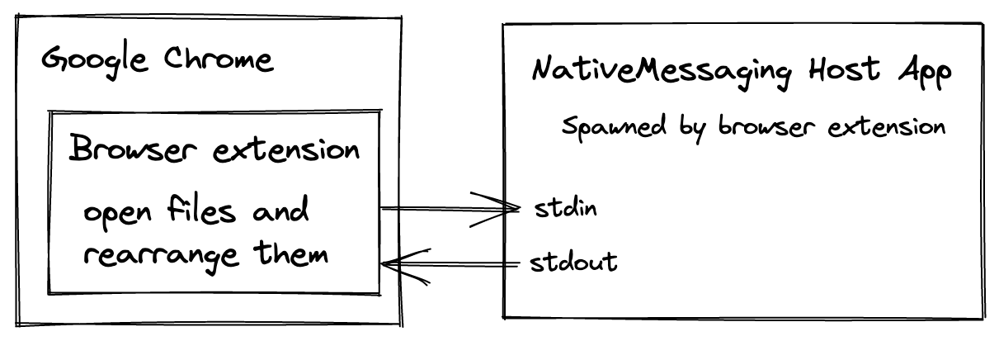

# probable-invention

Task automation at (my) work.

### Scenario:

PDFs are opened in Google Chrome (because there's least UI clutter and I can
change active tab with shortcuts) and shown in specific order on projector screen.
Files are named "1 zxc", "2 qwe", "2.1 asd", "3 poiu"...

I wrote PowerShell script to automate opening files in order, but it's somewhat random and I have to reorder tabs manually.

This is attempt to automate workflow with another approach.

  

Because this solution uses browser extension and native host application,
there's room for further "probable" improvement:
- I can (I think) create GUI app to control active tab/zoom etc. without focusing Google Chrome window
- inject CSS to hide controls in Chrome's PDF viewer (is this even possible?)

### development

#### install native messaging manifest (on macOS)

`cp ./native-application-chrome-manifest/probable_invention.json ~/Library/Application Support/Google/Chrome/NativeMessagingHosts/probable_invention.json`

#### chrome extension:

`vite build --watch` will watch for changes in files and rebuild automatically on save

#### go native app

install [watcher](https://github.com/canthefason/go-watcher) and then `watcher` will watch for changes in files and rebuild automatically on save

### links

[typescript extension template](https://github.com/DesignString/react-typescript-web-extension-starter)

[golang "base" code](https://github.com/jfarleyx/chrome-native-messaging-golang)

[chrome native messaging docs](https://developer.chrome.com/docs/apps/nativeMessaging/)

[golang ipc](https://github.com/james-barrow/golang-ipc)

### typescript

https://betterprogramming.pub/creating-chrome-extensions-with-typescript-914873467b65

https://bobbyhadz.com/blog/typescript-property-value-not-exist-type-htmlelement
